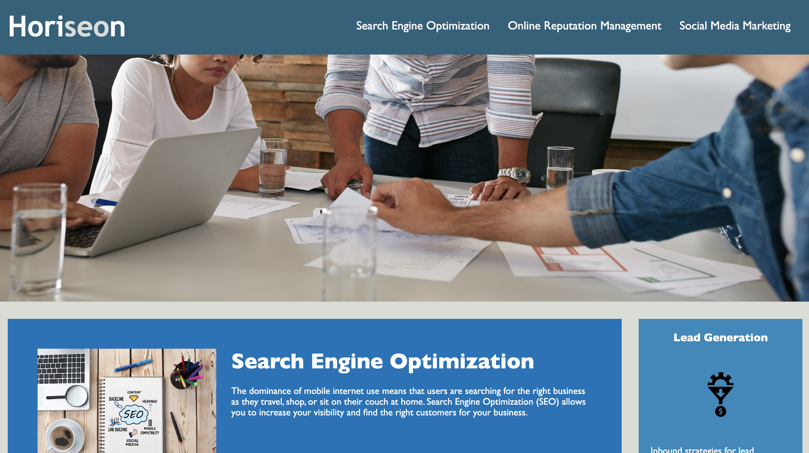

# 02-challenge-websitefix-project

## Description

Horiseon Social Solution Services, Inc website provide marketing details for various services such as Search Engine Optimization, Online Reputation Management, Social Media Marketing 

This is a refactor project to improve the web accessibility by using semantic html tags and act as a sample website for clients.

## Usage

Website has navigation tags for various sections using anchor tags

Website has been deployed using GitHub pages and can be reached through below link, 
https://chandraucb.github.io/02-challenge-websitefix/

